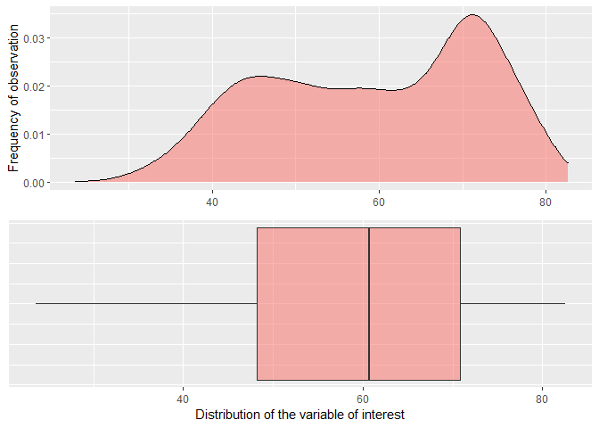
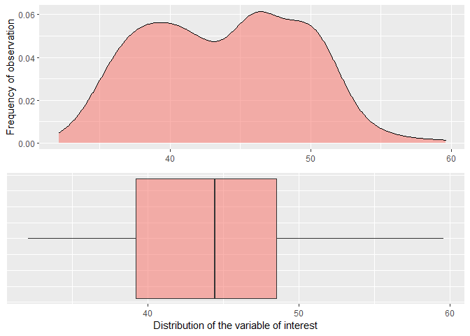
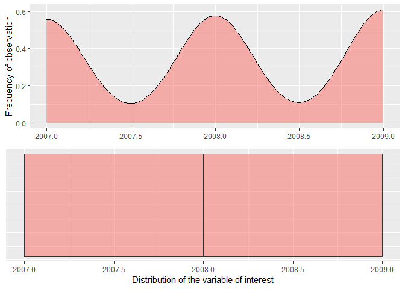

<!-- README.md is generated from README.Rmd. Please edit that file -->

# summary.stats

<!-- badges: start -->

<!-- badges: end -->

The goal of summary.stats is to produce a text ready summary of a
numeric vector with summary statistics, and to plot the distribution of
a numeric variable of interest. It contains the function sum.stats.

## Installation

summary.stats is not yet on CRAN. But, you can download it from this
repository using the following R command:

``` r
devtools::install_github("jacob5/summary.stats")
```

## Example

This is a basic example which shows you how to solve a common problem:

``` r
library(summary.stats)
library(gapminder)
sum_stats(gapminder, gapminder$lifeExp)
```



    #> [1] "For the provided data, the mean is: 59.47 the median is: 60.71 , the interquartile range is: 22.65 , and the standard deviation is: 12.92 . Plots generated. Check them out to view the distribution of the variable of interest"

This package is special because it produces a string in text format
which is easy to incorporate into a sentence, and quickly visualizes
data distribution.

``` r
library(palmerpenguins)
sum_stats(penguins, penguins$bill_length_mm)
#> Warning: Removed 2 rows containing non-finite values (stat_density).
#> Warning: Removed 2 rows containing non-finite values (stat_boxplot).
```



    #> [1] "For the provided data, the mean is: 43.92 the median is: 44.45 , the interquartile range is: 9.27 , and the standard deviation is: 5.46 . Plots generated. Check them out to view the distribution of the variable of interest"
    sum_stats(penguins, penguins$year)



    #> [1] "For the provided data, the mean is: 2008.03 the median is: 2008 , the interquartile range is: 2 , and the standard deviation is: 0.82 . Plots generated. Check them out to view the distribution of the variable of interest"
